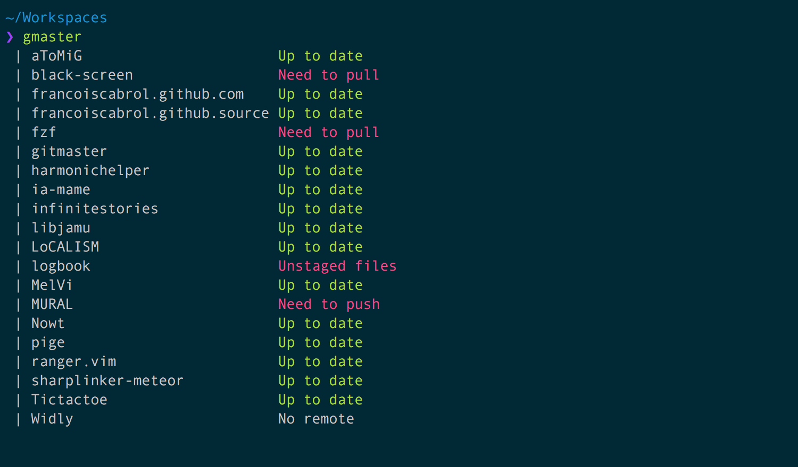

GitMaster - Manage a set of git repositories
=========

GitMaster is a small command line tool with two simple goals:

1. Offer an overview of all your git repositories in any directory as your $HOME/WORKSPACE. For example using the command `gmaster status` or `gmaster fetch status`.


2. Manage a set of git repositories with a third git "master repo". For example, you have a project with several services or subprojects, Each project is store in a different repository. You want to allows any developer to clone the master repository and then clone all repositories. Then you want to allow the developer to check or pull every repositories at the same time. This tool do that.

Features
--------
`gmaster help` list the commands:

```
Actions
 | dump      Dump the list of repositories in the .gitmaster file
 | init      Clone all repositories defined in the .gitmaster file
 | fetch     Fetch each repositories
 | status    Show the status of each repositories
 | pull      Pull each repositories
 | clone     Clone the repository
 | --version Print the version number
 | help      Show this help
Params
 | --dir    Directory where to execute the actions. Ex: gmaster --dir ~/Workpace. By default, it is the current directory.
 | --level  Levels of recursion. Ex: gmaster --level 2. By default, level is set to 1.
 | --group  If defined, show the repositories grouped by status. Ex: gmaster status --group. By default, it is inline.
 | --branch If defined, show the branch names. Ex: gmaster status --branch
```

Several commands can be executed in the same run. 
For example, `gitmaster fetch status` is going to first fetch the last remote versions and then display the status of each repository.

Install it
----------

Under Linux/Macos, you have just to copy the "gmaster" file in your bin path. For example under ~/bin.

The following command is going to install the latest release for you. You can replace the GITMASTER_PATH to install it in an other folder (by default the path is ~/bin/gmaster).
```
curl https://raw.githubusercontent.com/francoiscabrol/gitmaster/master/install.sh | GITMASTER_PATH=$HOME/bin bash -x
```

Then you should be able to run direcly in your terminal `gmaster help`.

You can try to run `gmaster` in your Workspace to check the status of your repositories.

Requirement: You need java installed. And git of course.
I tried it under MacOS, Linux Ubuntu and Arch Linux. It should works under window as well but I don't know how to install it.

Build it yourself
-----------------

Requirement: You need sbt (simple build tool) installed.

Then run `sbt assembly` to build the gmaster executable.

Develop
----------

Requirement: You need sbt (simple build tool) installed.

Run it with `sbt run ARGUMENTS` like `sbt run help` or `sbt run --dir ~/path/of/repositories/ status`

Create a release
----------------

After having merge a branch in master, the steps for creating a release are:
- Create the pre-release using the github interface with the version number as name.
- Wait for the CI proccess to build and upload the binary file as pre-release artifact.
- Set this pre-release as release.
